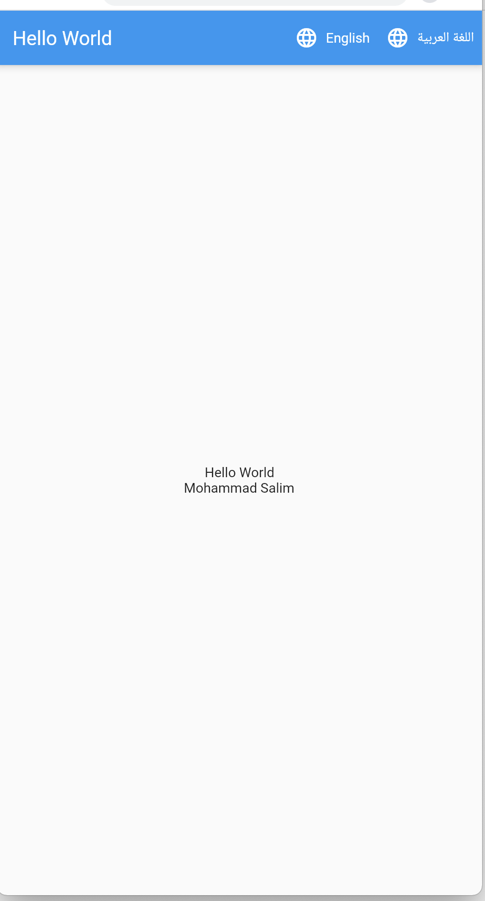

# flutter_app_localization

This app is an introduction to localizations in Flutter and show how how to internationalize a Flutter application. Thanks to Dr. Taha Basheer for the nice buttons design.

## Getting Started

This project is a starting point for a localizations in Flutter.

A few resources to get you started if this is your first Flutter internationalize project:

- [Introduction to localizations in Flutter](https://flutter.dev/docs/development/accessibility-and-localization/internationalization)
